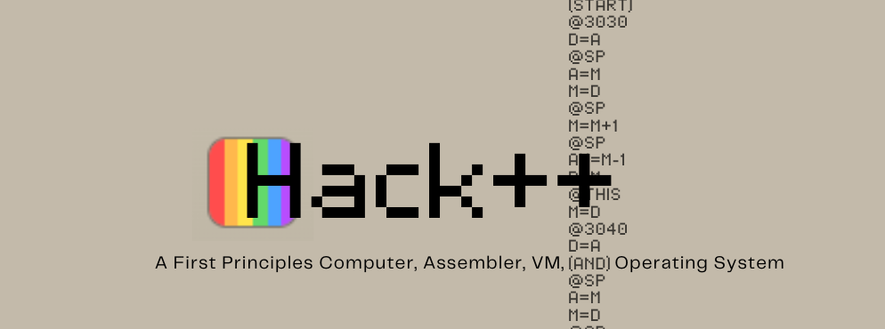

<!-- PROJECT LOGO -->
<br />
<div align="center">

  [![Issues][issues-shield]][issues-url] [![Google Tests][test-shield]][test-url]

  

</div>

---

<!-- ABOUT THE PROJECT -->
## About The Project
Hack++ is a first-principles computer system built from the ground up, starting with hardware designed with only 
the elementary NAND logic gate upto a functioning computer, and extending through an assembler, virtual machine, compiler, 
and operating system. The project follows the methodology outlined in the book [*The Elements of Computing Systems*](https://www.nand2tetris.org/book) 
(commonly known as nand2tetris).

This project represents a full re-implementation and extension of the baseline Hack platform with an emphasis on:
- Systems-level understanding
- Clean architectural boundaries
- Practical tooling (emulator, web UI, and test harnesses)

> Full technical reference (HDL, ISA, VM grammar, memory maps, and processor internals) lives in `/docs`.

### Requirements
- Docker

### Quick Start
1. Ensure you meet the given requirements, see above
2. Clone this repository
3. Navigate to root
4. Build and start the container:
>```shell
> docker build -t hack-webemu-static -f Dockerfile .
> docker run --name hack-webemu --rm -p 8080:8080 hack-webemu-static
>```
5. Open your browser to `http://localhost:8080`
6. Stop the container:
>```bash
> docker stop hack-webemu
>```


### Repository Structure
```text
./
 ├─ assets/         # Repo/docs Images
 ├─ core/           # C/C++ Hardware Emulator
 ├─ docs/           # Technical Reference
 ├─ programs/       # Hack++ Programs
 ├─ toolchain/
 │   ├─ compiler/   # Compiler   (file.jack → file.vm)
 │   ├─ vm/         # Translator (file.vm   → file.asm)
 │   └─ assembler/  # Assembler  (file.asm  → file.hack)
 ├─ web/            # Web UI
 └─ README.md
```

### Roadmap
- [x] Complete Nand2Tetris baseline implementation

#### Core Architecture
- [ ] Implement Hack++ hardware simulation Core in C
    - [ ] CPU (ALU, registers, control logic)
    - [ ] Memory model (RAM + MMIO)
        - ROM loading interface
    - [ ] Framebuffer MMIO
    - [ ] Keyboard MMIO
- [ ] Define Core types
    - [ ] `status_t`
        - `enum` containing execution state  
          (`0: idle, 1: loaded, 2: running, 3: stopped, 4: error`)
    - [ ] `state_t`
        - `struct` containing current execution state  
          (`status`, `pc`, `cycles`)
- [ ] Define Core ABI
    - [ ] `void init(void)`
    - [ ] `void load_rom(const uint16_t* program, size_t length)`
    - [ ] `void run(void)`
    - [ ] `void stop(void)`
    - [ ] `void step(void)`
    - [ ] `void reset(void)`
    - [ ] `void set_keyboard(uint16_t value)`
    - [ ] `state_t get_state(void)`
    - [ ] `const uint16_t* get_framebuffer_ptr(void)`

#### Runtime Integration (JS ↔ WASM)
- [x] Decide on primary datatype: `uint16_t`
    - To match 16-bit word size
- [ ] Compile C core to WebAssembly
- [ ] Implement `machineClient`
    - [x] Mock machine implementation
    - [ ] WASM-backed implementation
    - [ ] Binary (ROM) loader
    - [ ] Memory bridge (TypedArray ↔ WASM)
- [ ] Implement `machineHook`
    - [x] State management (pc, cycles, status)
    - [x] Control interface (run/stop/step/reset)
    - [ ] Polling / execution loop for `run()`
    - [ ] Framebuffer sync strategy

#### Frontend UI (React)
- [x] Console frame + CRT display
- [x] Program loader
- [x] Machine controls (run/stop/step/reset)
- [x] Machine status panel
- [x] Assembly inspector (modal)
- [ ] Keyboard input → MMIO bridge
- [ ] Runtime performance tuning (large programs like `Pong`)

#### Program Pipeline
- [x] Program catalog
- [x] ASM loader (for inspection)
- [x] Binary loader (.hack → Uint16Array)
- [ ] Ensure 1:1 ASM ↔ ROM mapping
    - Track assembler optimization
- [ ] Stretch: in-browser toolchain
    - [ ] In-browser editor (merge with FreshlyGround...)
    - [ ] Compilation chain (Jack → VM → ASM → binary)

#### Testing & Validation
- [ ] Unit tests for C Core (GoogleTest)
    - [ ] Framebuffer
    - [ ] Memory
    - [ ] CPU
    - [ ] API / ABI boundry
- [ ] Golden Tests for instruction correctness (GoogleTest)
    - [ ] CPU
    - [ ] Software toolchain
- [ ] Leak checks (LLVM)
- [ ] Integration tests (Vitest)
    - [ ] Client for Core boundry ABI
    - [ ] App for runtime behavior

#### Documentation
- [ ] Maintain Hack++ reference (NAND → Computer → Runtime)
    - [ ] Hardware abstractions (gates → circuits → modules → subsystems)
    - [ ] Software abstractions (source → IR → machine code → execution)
- [ ] Maintain VitePress documentation site
    - [ ] Structured navigation across hardware and software layers
    - [ ] Diagrams (gates/circuits, datapath, memory map, control flow)
- [ ] Document Core ABI (C ↔ WASM)
    - [ ] Function interface and machine state
    - [ ] Framebuffer and keyboard MMIO
- [ ] Document system model
    - [ ] Memory map (RAM, screen, keyboard)
    - [ ] Execution model (step vs run)
- [ ] Include high-level architecture diagram in README

## Project Architecture

### Components
| Component         | Description                                                                |
|-------------------|----------------------------------------------------------------------------|
| core (C)          | Hardware simulation of the Hack++ computer (CPU, memory, MMIO, execution). |
| assembler.c       | Converts assembly into binary (ROM image) loaded into the core.            |
| vm.c              | Translates VM bytecode into Hack assembly.                                 |
| compiler.c        | Compiles Jack programs into VM bytecode.                                   |
| machineClient.js  | Runtime bridge that loads binaries and communicates with the core.         |
| machineHook.js    | React hook that manages machine state and exposes control operations.      |
| app.jsx           | Main UI layer that wires machine state to visual components.               |
| Frame / CRT       | Renders framebuffer output from the core to the screen.                    |
| Controls          | UI for program loading and execution (run, step, reset).                   |
| AssemblyPanel     | Debug view for inspecting program source and execution state.              |


## The /docs
Read the [docs](https://hackplusplus-docs.onrender.com/) to get a better understanding of the project.

## Acknowledgments

### Dr. Nisan & Dr. Schocken
Based on **The Elements of Computing Systems** by Nisan & Schocken and inspired by modern systems engineering practices.

If you are interested in computer architecture, compilers, or operating systems, I strongly recommend the
book — it provides the conceptual foundation for everything implemented here.

### Charles Stevenson
Adapted from work originally authored by Charles Stevenson, licensed under the MIT License. The content has been 
reformatted and edited for clarity and consistency within the Hack++ project docs. The original author retains 
full credit for the underlying technical description.

Stevenson, C. (2024-05-30). CodeWriter.java — Adapted for use in Hack VM memory model documentation.
- Original source repository: https://github.com/brucesdad13/nand2tetris-vm-translator

### Christian Vallentin
EBNF syntax highlighting file authored by Christian Vallentin, licensed under the MIT License. The original 
author retains full credit for their work.

Christian, V. (2020-06-03). bnf.tmLanguage.json — File used in Hack documentation syntax.
- Original source repository: https://github.com/vallentin/vscode-bnf

<!-- MARKDOWN LINKS & IMAGES -->

<!-- Tests Shield -->
[test-shield]: https://github.com/josephhilby/HackPlusPlus/actions/workflows/gtest_test_ci.yml/badge.svg
[test-url]: https://github.com/josephhilby/HackPlusPlus/actions/workflows/gradle_test_ci.yml

<!-- Issues Shield -->
[issues-shield]: https://img.shields.io/github/issues/josephhilby/HackPlusPlus.svg
[issues-url]: https://github.com/josephhilby/HackPlusPlus/issues
