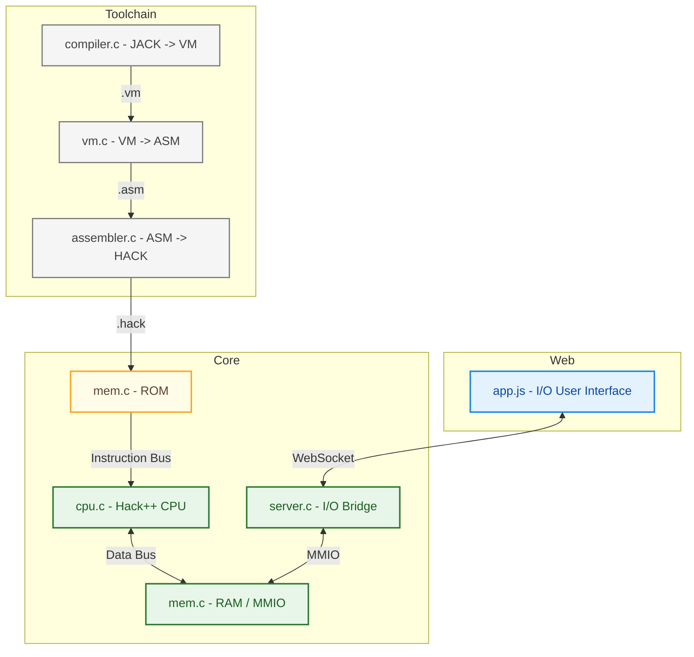

<!-- PROJECT LOGO -->
<br />
<div align="center">

  [![Issues][issues-shield]][issues-url] [![Google Tests][test-shield]][test-url]

  

</div>

---

<!-- ABOUT THE PROJECT -->
## About The Project
Hack++ is a first-principles computer system built from the ground up, starting with hardware designed with only 
the elementary NAND logic gate upto a functioning computer, and extending through an assembler, virtual machine, compiler, 
and operating system. The project follows the methodology outlined in the book [*The Elements of Computing Systems*](https://www.nand2tetris.org/book) 
(commonly known as nand2tetris).

This project represents a full re-implementation and extension of the baseline Hack platform with an emphasis on:
- Systems-level understanding
- Clean architectural boundaries
- Practical tooling (emulator, web UI, and test harnesses)

> Full technical reference (HDL, ISA, VM grammar, memory maps, and processor internals) lives in `/docs`.

### Requirements
- Docker

### Quick Start
1. Ensure you meet the given requirements, see above
2. Clone this repository
3. Navigate to root
4. Build and start the container:
>```shell
> docker build -t hack-webemu-static -f Dockerfile .
> docker run --name hack-webemu --rm -p 8080:8080 hack-webemu-static
>```
5. Open your browser to `http://localhost:8080`
6. Stop the container:
>```bash
> docker stop hack-webemu
>```


### Repository Structure
```text
./
 ├─ assets/         # Repo/docs Images
 ├─ core/           # C/C++ Hardware Emulator
 ├─ docs/           # Technical Reference
 ├─ programs/       # Hack++ Programs
 ├─ toolchain/
 │   ├─ compiler/   # Compiler   (file.jack → file.vm)
 │   ├─ vm/         # Translator (file.vm   → file.asm)
 │   └─ assembler/  # Assembler  (file.asm  → file.hack)
 ├─ web/            # Web UI
 └─ README.md
```

### Roadmap
- [x] Complete Nand2Tetris baseline implementation
- [x] Create front end web UI
    - [x] Create app.js, style.css, index.html
    - [x] Create server.h/c to provide updates for screen and keyboard MMIO
    - [x] Connect mem.c to app.js via websocket to allow MMIO
      - app.js ⇄ (HTTP/WS) ⇄ server.c ⇄ mem.c
    - [x] Update README
- [ ] Emulate HACK CPU, and MEMORY.
    - [ ] CPU
    - [x] MEM
    - [ ] Update README
- [ ] Rework baseline implementation from Python to C
    - [x] Assembler
    - [x] VM
    - [ ] Compiler
    - [ ] OS
    - [ ] Update README
- [ ] Test with Google Test (unit/golden) and LLVM (leak)
    - [x] Assembler
    - [x] VM
    - [ ] Compiler
    - [ ] OS
    - [ ] CPU
    - [ ] MEM
    - [ ] Update README

## Project Architecture

### Components
| Component   | Description                                                                                   |
|-------------|-----------------------------------------------------------------------------------------------|
| compiler.c  | Stack based compiler that produces VM bytecode code from Jack code.                           |
| vm.c        | Stack based vm that produces assembly for the Hack CPU from VM bytecode code.                 |
| assembler.c | Two-pass assembler that produces binary code and resolves symbols, labels, and variables.     |
| mem.c       | Software emulation of the Hack ROM, RAM, screen buffer, and last press keyboard interface.    |
| cpu.c       | Software emulation of the Hack CPU.                                                           |
| server.c    | Bridges emulator state to the web UI using the Mongoose WebSocket.                            |
| app.js      | Sends screen output to `index.html` for rendering and collects last key pressed user input.   |

### Diagram


## The /docs
link TBD

## Acknowledgments

### Dr. Nisan & Dr. Schocken
Based on **The Elements of Computing Systems** by Nisan & Schocken and inspired by modern systems engineering practices.

If you are interested in computer architecture, compilers, or operating systems, I strongly recommend the
book — it provides the conceptual foundation for everything implemented here.

### Charles Stevenson
Adapted from work originally authored by Charles Stevenson, licensed under the MIT License. The content has been 
reformatted and edited for clarity and consistency within the Hack++ project docs. The original author retains 
full credit for the underlying technical description.

Stevenson, C. (2024-05-30). CodeWriter.java — Adapted for use in Hack VM memory model documentation.
- Original source repository: https://github.com/brucesdad13/nand2tetris-vm-translator

### Christian Vallentin
EBNF syntax highlighting file authored by Christian Vallentin, licensed under the MIT License. The original 
author retains full credit for their work.

Christian, V. (2020-06-03). bnf.tmLanguage.json — File used in Hack documentation syntax.
- Original source repository: https://github.com/vallentin/vscode-bnf

<!-- MARKDOWN LINKS & IMAGES -->

<!-- Tests Shield -->
[test-shield]: https://github.com/josephhilby/HackPlusPlus/actions/workflows/gtest_test_ci.yml/badge.svg
[test-url]: https://github.com/josephhilby/HackPlusPlus/actions/workflows/gradle_test_ci.yml

<!-- Issues Shield -->
[issues-shield]: https://img.shields.io/github/issues/josephhilby/HackPlusPlus.svg
[issues-url]: https://github.com/josephhilby/HackPlusPlus/issues
