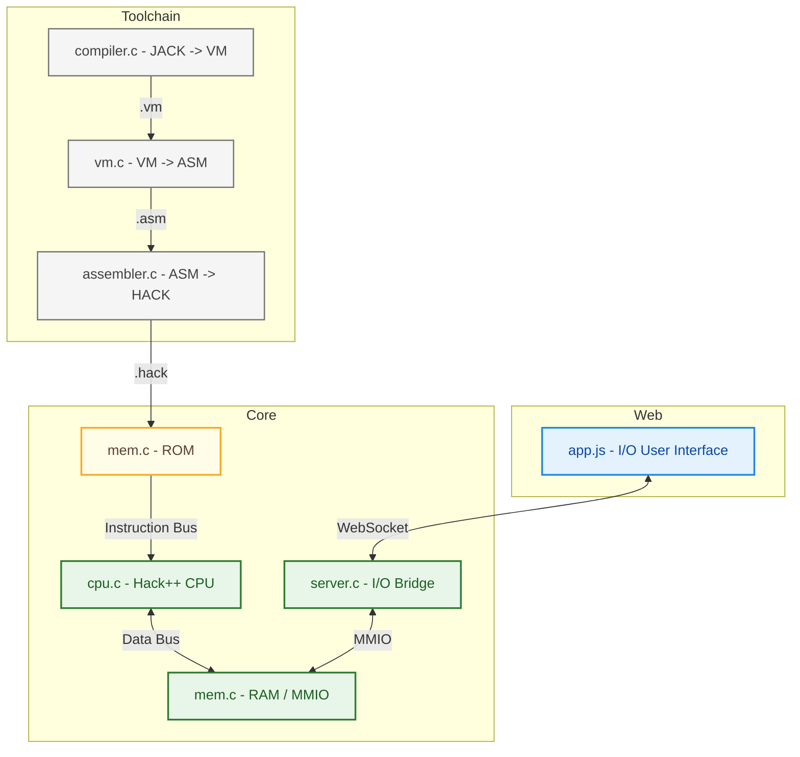

<!-- PROJECT LOGO -->
<br />
<div align="center">
  <a href="https://github.com/<your_repo>">
    
  </a>
</div>

---

<!-- ABOUT THE PROJECT -->
## About The Project
Hack++ is a first-principles computer system built from the ground up, starting with hardware built with 
the elementary NAND logic gate and extending through an assembler, virtual machine, and operating system. The project 
follows the methodology outlined in the book [*The Elements of Computing Systems*](https://www.nand2tetris.org/book) (commonly known as nand2tetris).

This project represents a full re-implementation and extension of the baseline Hack platform with an emphasis on:
- Systems-level understanding
- Clean architectural boundaries
- Practical tooling (emulator, web UI, and test harnesses)
  
If you are interested in computer architecture, compilers, or operating systems, I strongly recommend the 
book — it provides the conceptual foundation for everything implemented here.

### Requirements
- Docker

### Get Started
```shell
docker build -t hack-webemu-static -f docker/Dockerfile .
docker run --rm -p 8080:8080 hack-webemu-static
```

Once running, open your browser and navigate to: `http://localhost:8080`

### Roadmap
- [x] Complete Nand2Tetris baseline implementation
- [x] Create front end web UI
    - [x] Create app.js, style.css, index.html
    - [x] Create server.h/c to provide updates for screen and keyboard MMIO
    - [x] Connect server.c to app.js via websocket
      - app.js ⇄ (HTTP/WS) ⇄ server.c ⇄ mem.c
    - [x] Update README
- [ ] Emulate HACK CPU, and MEMORY.
    - [ ] CPU
    - [x] MEM
- [ ] Rework baseline implementation from Python to C
    - [x] Assembler
    - [x] VM
    - [ ] Compiler
    - [ ] OS
- [ ] Test with Google Test (unit/golden) and LLVM (leak)
    - [x] Assembler
    - [x] VM
    - [ ] Compiler
    - [ ] OS

## Emulator Architecture

### Components
| Component (Language)   | Description                                                                                                                     |
|------------------------|---------------------------------------------------------------------------------------------------------------------------------|
| Compiler (C)           | Stack based compiler that produces binary Hack VM code.                                                                         |
| VM Translator (C)      | Parses and lowers Hack VM code into Hack assembly with built-in runtime helpers (comparisons, branching, function call/return). |
| Assembler (C)          | Two-pass assembler that resolves symbols, labels, and variables, producing binary Hack machine code.                            |
| CPU / Memory Core (C)  | Software emulation of the Hack CPU, RAM, MMIO, screen buffer, and keyboard interface.                                           |
| Server (C)             | Bridges emulator state to the web UI using HTTP and WebSockets.                                                                 |
| Frontend (JS/CSS/HTML) | Visualizes memory, registers, and screen output in real time.                                                                   |
| Tests (C++)            | Golden tests for assembler, VM, and compiler output, plus sanitizer-based memory and correctness checks.                        |


### Diagram


## Hardware Architecture
All hardware in Hack++ (and Hack) is described via a Hardware Description Language (HDL), and constructed from the single
elementary logic gate NAND. These HDL files can be found in the `\docs` section of this repo. It's implementation however
is emulated in the C programming language according to the below specifications, and can be found in the `\core` section 
of this repo.

At its core, Hack++ follows a von Neumann architecture; programs and data are stored in memory, accessed and 
manipulated by a central processing unit (CPU) composed of:
- Registers — for holding intermediate values and addresses
- ALU (Arithmetic Logic Unit) — for performing integer arithmetic and bitwise logic

The CPU itself is intentionally minimal. It contains only two programmer-visible registers:
- D Register — 16-bit data register
- A Register — 16-bit address register

The ALU operates on 16-bit signed integers and supports a constrained set of operations:
- Addition and subtraction
- Bitwise AND and OR
- Unary negation and bitwise NOT

Memory is divided into two logical regions:
- ROM (Read-Only Memory) — stores program instructions
- RAM (Random Access Memory) — stores program state, stack, heap, and memory-mapped I/O


### Instruction Set Architecture
To instruct the CPU, the ROM is loaded with a program in the form of a `.hack` binary file. That file is
assembled from a more human-readable assembly language file (`.asm`). The mapping between the two can be found 
in `\docs`, however as to not get bogged down in ones and zeros here, we will skip the binary and proceed directly 
to the assembly language syntax, and describe it in Extended Backus–Naur Form (EBNF).

While it looks imposing it really boils down to two steps:
1. Determine if the CPU needs to load an address into the A Register (a_instruction) or compute a value (c_instruction).
2. Map the mnemonics in `value` (a_instruction) or `comp`, `dest`, `jump` (c_instruction) to binary.

A quick example could be:
```asm
// Foo.asm
...
@BAR   // load address attributed to BAR in A Register
0;JMP  // Jump to instruction ROM[BAR]
...
(BAR)  // Address label being jumping to
@SP    // First line of code after the jump
...
```

Labels, comments, and lines can all be ignored, for now. With that, below is the EBNF for the Hack++ assembly language.

#### Assembly Grammar (EBNF)
```ebnf
non-terminal  ::= production rule
---               ---
program       ::= { line }

line          ::= [ insrtuction | label ] [ comment ] newline
comment       ::= "//" { any_char_except_newline }

instruction   ::= a_instruction | c_instruction

a_instruction ::= "@" value

c_instruction ::= [ dest "=" ] comp [ ";" jump ]

dest          ::= dest_char { dest_char }
dest_char     ::= "A" | "D" | "M"

comp          ::=  "0" |  "1" | "-1"
                |  "A" |  "D" |  "M"
                | "!A" | "!D" | "!M"
                | "-A" | "-D" | "-M"
                | "A+1" | "D+1" | "M+1"
                | "A-1" | "D-1" | "M-1"
                | "D+A" | "D+M"
                | "D-A" | "D-M" | "A-D" | "M-D"
                | "D&A" | "D&M"
                | "D|A" | "D|M"

jump          ::= "JGT" | "JEQ" | "JGE" | "JLT" | "JNE" | "JLE" | "JMP"

label         ::= "(" symbol ")"

value         ::= constant | symbol

constant      ::= integer (* 0 <= integer <= 32767 *)
```
**Legend:**
- `{ … }` = zero or more
- `[ … ]` = optional (zero or one)
- `|` = alternative
- Keywords (`"LET"`, `"DEF"`, etc.) are case-sensitive

**Predefined Symbols**
```
R1..R15, SP, LCL, ARG, THIS, THAT, SCREEN, KBD
```

**Tokens**
```regexp
integer := ^[0-9]+$
symbol  := [A-Za-z_$:.] [A-Za-z0-9_-]*
newline := [\r\n]
```

### Memory Map
The Hack platform's RAM exposes 32K words of 16-bit, mapped as follows (decimal addresses):

| Address Range       | ASM Name   | Usage                                                |
|---------------------|------------|------------------------------------------------------|
| `RAM[0]`            | `SP`       | Current top of the stack                             |
| `RAM[1]`            | `LCL`      | Base of the current function's local segment         |
| `RAM[2]`            | `ARG`      | Base of the current function's argument segment      |
| `RAM[3]`            | `THIS`     | Base of the current function's `this` segment (heap) |
| `RAM[4]`            | `THAT`     | Base of the current function's `that` segment (heap) |
| `RAM[5..12]`        | `TEMP`     | Segment for current function's temporary storage     |
| `RAM[13..14]`       | `R13..R14` | General-purpose registers                            |
| `RAM[15]`           | `R15`      | Return Address register                              |
| `RAM[16..255]`      | —          | Static variables (assigned at compile time)          |
| `RAM[256..2047]`    | —          | Stack                                                |
| `RAM[2048..16383]`  | —          | Heap                                                 |
| `RAM[16384..24575]` | —          | Memory-mapped video I/O (512×256 monochrome display) |
| `RAM[24576]`        | —          | Memory-mapped keyboard I/O (Last key pressed)        |
| `RAM[24577..32767]` | —          | Unused                                               |
<p align="right">(<a href="#Attribution">see, Attribution</a>)</p>

## Virtual Machine (VM) Architecture

With the instruction set architecture being covered, the ROM being a simple linear set of commands that can be accessed
at will, and the RAM being a working table for the CPU to put values that it will need to track (thus completes the 
compile time description). We can now focus on how Hack++ can keep track of inputs and changes made by the user that 
will interrupt any perfectly ordered error free program file... \s.

//todo: brief paragraph about general aspects of the VM arch

#### Memory Segments
The VM exposes eight logical memory segments to every function:

| Segment    | Purpose                     | Allocation / Behavior                                                    |
| ---------- |-----------------------------|--------------------------------------------------------------------------|
| `local`    | Stores local variables      | Allocated per `func` when a function is called / sized by `nlocals`      |
| `argument` | Stores function arguments   | Allocated per `func` when a function is called / sized by `nargs`        |
| `this`     | General-purpose segment     | Used to manipulate heap-based data structures                            |
| `that`     | General-purpose segment     | Used to manipulate heap-based data structures                            |
| `temp`     | Temporary variables         | Eight multi-purpose registers shared across all functions                |
| `static`   | Stores static variables     | RAM[16..255] / shared across all functions in that file, (`file_name.i`) |
| `pointer`  | Base address selectors      | `pointer 0` aligns `this`, `pointer 1` aligns `that`                     |
| `constant` | Immediate values (0..32767) | Pseudo-segment not stored in RAM shared across all functions             |
<p align="right">(<a href="#Attribution">see, Attribution</a>)</p>


#### Data Types
- integer - 16-bit signed via two's complement 
- bool - -1: true, 0: false

#### VM Grammar (EBNF)
**Tokens**
```regexp
integer    := ^[0-9]+$
identifier := ^[A-Za-z_$:.][A-Za-z0-9_-]*
newline    := [\r\n]
```

**Syntax**
```ebnf
non-terminal  ::= production rule
---               ---
program       ::= { line }

line          ::= [ command ] [ comment ] newline
comment       ::= "//" { any_char_except_newline }

command       ::= arithmetic | memory | branching | function

arithmetic    ::= "add" | "sub" | "neg" | "eq" | "gt" | "lt" | "and" | "or" | "not"

memory        ::= ("push" | "pop") segment index  (* segment[index] *)
segment       ::= "local" | "argument" | "this" | "that" | "temp" | "static" | "pointer" | "constant"
index         ::= integer

branching     ::= ("label" | "goto" | "if-goto") label

function      ::= "function" function_name nlocals | "call" function_name nargs | "return"

label         ::= identifier
function_name ::= identifier
nlocals       ::= integer  (* number of locals allocated by callee*)
nargs         ::= integer  (* number args passed by caller *)
```
**Legend:**
- `{ … }` = zero or more
- `[ … ]` = optional (zero or one)
- `|` = alternative
- Keywords (`"LET"`, `"DEF"`, etc.) are case-sensitive

**Semantics**

| Command      | Type	      | Effect                                                                   |
|--------------|------------|--------------------------------------------------------------------------|
| push	        | memory     | Reads value from designated VM segment[index] and pushes it onto the stack |
| pop	         | memory     | Pops the stack top and stores it into designated VM segment[index]       |
| eq / lt / gt | arithmetic | 	Pops two operands, compares, pushes -1 (true) or 0 (false) onto the stack |
| and / or     | arithmetic | Pops two operands, compares, pushes result onto the stack                |
| not          | arithmetic | Pops one operatnd, inverts, pushes result onto the stack                 |
| add / sub    | arithmetic | Pops two operatnds, computes, pushes result onto the stack               |
| neg          | arithmetic | Pops one operatnd, negates, pushes result onto the stack                 |
| function     | function   | 	Declares a function and allocates local variables                       |
| call         | function   | 	Sets up a call frame and transfers control                              |
| return       | function   | 	Restores caller frame and jumps back                                    |


## Attribution

The denoted work in my documentation was adapted from work originally authored by Charles Stevenson, licensed 
under the MIT License.

Stevenson, C. (2024-05-30). CodeWriter.java — Hack VM memory model documentation.
Original source repository:
https://github.com/brucesdad13/nand2tetris-vm-translator

The content has been reformatted and edited for clarity and consistency within the Hack++ project README.
The original author retains full credit for the underlying technical description.

## Acknowledgments

Based on **The Elements of Computing Systems** by Nisan & Schocken and inspired by modern systems engineering practices.
