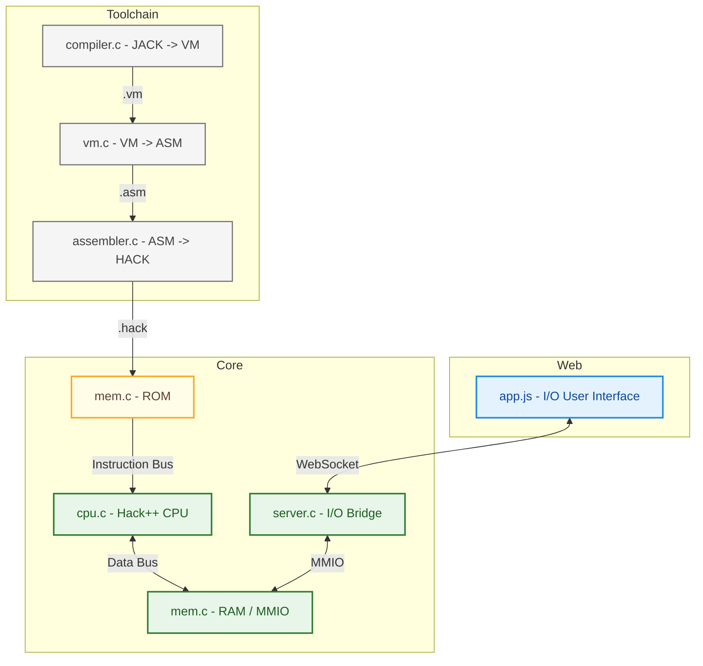

<!-- PROJECT LOGO -->
<br />
<div align="center">
  <a href="https://github.com/<your_repo>">
    
  </a>
</div>

---

<!-- ABOUT THE PROJECT -->
## About The Project
Hack++ is a first-principles computer system built from the ground up, starting with hardware designed with only 
the elementary NAND logic gate upto a functioning computer, and extending through an assembler, virtual machine, compiler, 
and operating system. The project follows the methodology outlined in the book [*The Elements of Computing Systems*](https://www.nand2tetris.org/book) 
(commonly known as nand2tetris).

This project represents a full re-implementation and extension of the baseline Hack platform with an emphasis on:
- Systems-level understanding
- Clean architectural boundaries
- Practical tooling (emulator, web UI, and test harnesses)

> Full technical reference (HDL, ISA, VM grammar, memory maps, and processor internals) lives in [/docs](./docs/00_index.md).

### Requirements
- Docker

### Quick Start
```shell
docker build -t hack-webemu-static -f docker/Dockerfile .
docker run --rm -p 8080:8080 hack-webemu-static
```

Open: `http://localhost:8080`

### Repository Structure
```text
assets/               # Repo/docs Images
core/                 # C Emulator
docs/                 # Technical Reference
programs/             # Hack Programs for running in UI
toolchain/compiler/   # Compiler (file.jack → file.vm)
toolchain/vm/         # Translator (file.vm → file.asm)
toolchain/assembler/  # Assembler (file.asm → file.hack)
web/                  # Web UI
```

### Roadmap
- [x] Complete Nand2Tetris baseline implementation
- [x] Create front end web UI
    - [x] Create app.js, style.css, index.html
    - [x] Create server.h/c to provide updates for screen and keyboard MMIO
    - [x] Connect mem.c to app.js via websocket to allow MMIO
      - app.js ⇄ (HTTP/WS) ⇄ server.c ⇄ mem.c
    - [x] Update README
- [ ] Emulate HACK CPU, and MEMORY.
    - [ ] CPU
    - [x] MEM
    - [ ] Update README
- [ ] Rework baseline implementation from Python to C
    - [x] Assembler
    - [x] VM
    - [ ] Compiler
    - [ ] OS
    - [ ] Update README
- [ ] Test with Google Test (unit/golden) and LLVM (leak)
    - [x] Assembler
    - [x] VM
    - [ ] Compiler
    - [ ] OS
    - [ ] CPU
    - [ ] MEM
    - [ ] Update README

## Project Architecture

### Components
| Component   | Description                                                                                   |
|-------------|-----------------------------------------------------------------------------------------------|
| compiler.c  | Stack based compiler that produces VM bytecode code from Jack code.                           |
| vm.c        | Stack based vm that produces assembly for the Hack CPU from VM bytecode code.                 |
| assembler.c | Two-pass assembler that produces binary code and resolves symbols, labels, and variables.     |
| mem.c       | Software emulation of the Hack ROM, RAM, screen buffer, and last press keyboard interface.    |
| cpu.c       | Software emulation of the Hack CPU.                                                           |
| server.c    | Bridges emulator state to the web UI using the Mongoose WebSocket.                            |
| app.js      | Sends screen output to `index.html` for rendering and collects last key pressed user input.   |

### Diagram


### Technical Reference
The full hardware and language specification is maintained in /docs:
- Hardware Stack — NAND → Gates → ALU → CPU → Computer
- Instruction Set Architecture — Hack++ binary + assembly syntax
- Memory Hierarchy — RAM, MMIO (screen & keyboard)
- Virtual Machine — stack model, segments, control flow
- System Integration — execution cycle, timing, and signal flow

#### /docs
| Topic                 | 	Document                                      | 
|-----------------------|------------------------------------------------|
| Hardware Overview     | [docs/00_index.md](./docs/00_index.md)         | 
| Primitive Gates	      | [docs/01_primitives.md](docs/01_primitives.md) |
| Sequential Logic	     | docs/05_sequential.md                          |
| Memory System	        | docs/06_memory.md                              |
| Processor (ALU + CPU) | docs/07_processor.md                           |
| System Integration	   | docs/08_system.md                              |
| ISA Specification	    | docs/09_instruction_set.md                     |
| VM Architecture	      | docs/10_vm.md                                  |
| OS                    | todo                                           |

## Acknowledgments

### Dr. Nisan & Dr. Schocken
> Based on **The Elements of Computing Systems** by Nisan & Schocken and inspired by modern systems engineering practices.
>
> If you are interested in computer architecture, compilers, or operating systems, I strongly recommend the
> book — it provides the conceptual foundation for everything implemented here.

### Charles Stevenson
> Adapted from work originally authored by Charles Stevenson, licensed under the MIT License.
>
> Stevenson, C. (2024-05-30). CodeWriter.java — Hack VM memory model documentation.
> Original source repository:
> https://github.com/brucesdad13/nand2tetris-vm-translator
>
> The content has been reformatted and edited for clarity and consistency within the Hack++ project README.
> The original author retains full credit for the underlying technical description.

