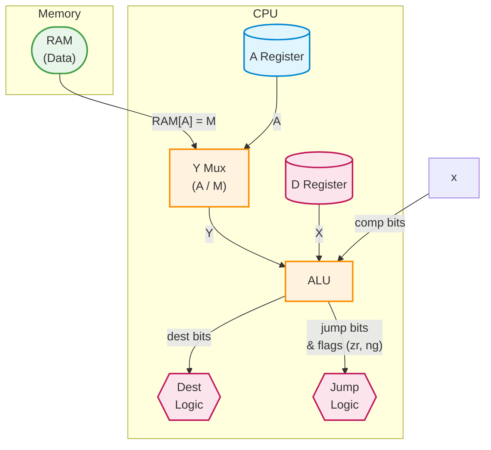

# 07 — Processor Components

This section documents the computational and control units that integrate datapath, state, and memory into an executing processor. Together, the **ALU** and **CPU** form the boundary between *pure computation* and *architectural control flow*.

At this layer, signals become **instructions**: bits are interpreted as operations, destinations, and jumps that shape program execution over time.


## Design Notes

**Datapath vs. Control**
The processor is cleanly split into two conceptual planes:

* **Datapath** — registers, buses, and the ALU that move and transform data
* **Control** — instruction decoding and jump logic that decide *what* the datapath should do next

**Timing discipline**

* Combinational paths (ALU, control decode, `outM`, `writeM`) reflect signals in the *current* cycle (`t`)
* State updates (`A`, `D`, `pc`, RAM writes) commit on the clock edge and become visible at `t+1`

**Single-cycle execution model**
Each instruction completes its compute, optional store, and jump decision in one cycle. Only architectural state (registers, PC, memory) is delayed to the next tick.

---

## Arithmetic Logic Unit (ALU)

The **ALU** is the computational core of Hack++. It implements all arithmetic and bitwise operations required by the ISA using a minimal, normalized pipeline driven by six control bits.

**Also known as:** *execution unit*, *datapath core*

### Interface

* Inputs: `x[16]`, `y[16]`
* Control: `zx, nx, zy, ny, f, no`
* Outputs: `out[16]`, `zr`, `ng`

### Control Pipeline

The ALU is defined by a deterministic four-stage pipeline:

1. **Normalize X**

    * `zx = 1` → `x = 0`
    * `nx = 1` → `x = !x`

2. **Normalize Y**

    * `zy = 1` → `y = 0`
    * `ny = 1` → `y = !y`

3. **Compute**

    * `f = 1` → `out = x + y` (two’s complement, 16-bit)
    * `f = 0` → `out = x & y`

4. **Post-process**

    * `no = 1` → `out = !out`

### Flags

* `zr = 1` iff `out == 0`
* `ng = out[15]` (MSB, sign bit)

These flags feed directly into the CPU’s jump logic.

### HDL

```java
CHIP ALU {
IN  
x[16], y[16],
zx, nx, zy, ny, f, no;

OUT
out[16], zr, ng;

    PARTS:
    // Normalize X
    Mux16(a=x, b[0..15]=false, sel=zx, out=w0);
    Not16(in=w0, out=w1);
    Mux16(a=w0, b=w1, sel=nx, out=xin);

    // Normalize Y
    Mux16(a=y, b[0..15]=false, sel=zy, out=w2);
    Not16(in=w2, out=w3);
    Mux16(a=w2, b=w3, sel=ny, out=yin);

    // Compute
    And16(a=xin, b=yin, out=and);
    Add16(a=xin, b=yin, out=add);
    Mux16(a=and, b=add, sel=f, out=result);

    // Post-process and flags
    Not16(in=result, out=nResult);
    Mux16(a=result, b=nResult, sel=no, out[15]=ng, out[8..15]=msb, out[0..7]=lsb);

    Or8Way(in=msb, out=w4);
    Or8Way(in=lsb, out=w5);
    Or(a=w4, b=w5, out=w6);
    Not(in=w6, out=zr);
    Or16(a[8..15]=msb, a[0..7]=lsb, b=false, out=out);
}
```

---

## Central Processing Unit (CPU)

The **CPU** integrates the ALU, registers, program counter, and control logic into a complete execution engine.

Each cycle, it:

1. Fetches `instruction[16]` from ROM
2. Optionally reads `inM = RAM[A]`
3. Computes via the ALU
4. Optionally stores results to `A`, `D`, or `M`
5. Optionally updates the `pc` via jump logic

**Also known as:** *control unit + datapath*, *execution core*

---

### Programmer-Visible State

* **A register** — address / operand register
* **D register** — data register
* **PC** — program counter

All other signals are internal to the execution pipeline.

---

### Instruction Classes

**A-instruction (MSB = 0)**
Loads a 15-bit value into `A`:

```text
0 vvv vvvv vvvv vvvv
```

* `A = instruction[0..14]`

**C-instruction (MSB = 1)**
Controls ALU computation, destinations, and jumps:

```text
111 a c1 c2 c3 c4 c5 c6 d1 d2 d3 j1 j2 j3
        comp              dest      jump
```

* `a` — selects ALU `y` source (`A` vs `M`)
* `c1..c6` — ALU control bits (`zx,nx,zy,ny,f,no`)
* `d1..d3` — destination enables (`A, D, M`)
* `j1..j3` — jump condition (driven by `zr`, `ng`)

---

### Signal Flow Summary

A-instruction (`@value`) loads the A register (blue), which immediately determines the memory address (`M = RAM[A]`) 
and selects the ALU’s `y` input (`A` vs. `M`) for subsequent instructions.

C-instruction (`dest=comp;jump`) routes the D register (pink) to `ALU.x` and selects `A` or `M` for `ALU.y` via the 
`a` bit. The ALU computes out under control of `c1..c6`, then:
- DEST uses `d1..d3` to write `out` to `A`, `D`, and/or `M`
- JUMP uses `j1..j3` and the ALU flags (`zr, ng`) to decide whether the PC loads `A` (jump) or increments (fall-through)



**Legend**
- Blue (A-instruction path): @value loads the A register (address/operand).
- Pink (C-instruction path): dest + jump behavior (writes to D/A/M, evaluates jump from zr/ng).
- Orange: core datapath compute/select (ALU + Y mux).
- Green: data memory (M = RAM[A]).

---

### HDL

```java
CHIP CPU {

IN  inM[16],
    instruction[16],
    reset;

OUT outM[16],
    writeM,
    addressM[15],
    pc[15];

    PARTS:
    // Instruction class
    And(a=instruction[15], b=true, out=insC);
    Mux16(a=instruction, b=ALUout, sel=insC, out=inA);

    // ALU control bits
    Mux(a=false, b=instruction[12], sel=insC, out=readMem);
    Mux(a=false, b=instruction[11], sel=insC, out=zx);
    Mux(a=false, b=instruction[10], sel=insC, out=nx);
    Mux(a=false, b=instruction[9],  sel=insC, out=zy);
    Mux(a=false, b=instruction[8],  sel=insC, out=ny);
    Mux(a=false, b=instruction[7],  sel=insC, out=f);
    Mux(a=false, b=instruction[6],  sel=insC, out=no);

    // Dest bits
    Mux(a=true,  b=instruction[5], sel=insC, out=loadA);
    Mux(a=false, b=instruction[4], sel=insC, out=loadD);
    Mux(a=false, b=instruction[3], sel=insC, out=writeM);

    // Jump bits
    Mux(a=false, b=instruction[2], sel=insC, out=lt0);
    Mux(a=false, b=instruction[1], sel=insC, out=eq0);
    Mux(a=false, b=instruction[0], sel=insC, out=gt0);

    // Registers
    ARegister(in=inA, load=loadA, out=outA, out[0..14]=addressM);
    DRegister(in=ALUout, load=loadD, out=x);

    // Jump logic
    Or(a=ng, b=zr, out=leq0);
    Not(in=leq0, out=ps);
    And(a=lt0, b=ng, out=jumpLt0);
    And(a=eq0, b=zr, out=jumpEq0);
    And(a=gt0, b=ps, out=jumpGt0);
    Or(a=jumpLt0, b=jumpEq0, out=jmp);
    Or(a=jmp, b=jumpGt0, out=jump);

    // Program counter
    PC(in=outA, load=jump, inc=true, reset=reset, out[0..14]=pc);

    // ALU datapath
    Mux16(a=outA, b=inM, sel=readMem, out=y);
    ALU(x=x, y=y, zx=zx, nx=nx, zy=zy, ny=ny, f=f, no=no,
        out=ALUout, out=outM, zr=zr, ng=ng);
}
```

---

## Architectural Context

The processor layer is where **syntax becomes semantics**:

* The **ISA** defines how bit patterns are interpreted as operations
* The **CPU** decodes those patterns into control signals
* The **ALU** executes the resulting computation
* The **PC** turns results into control flow

Together, they form a closed execution loop:

```text
Fetch → Decode → Execute → Store → Jump → Fetch
```

This loop is the foundation upon which the VM and compiler layers build higher-level abstractions.
