# Hack++ Reference

Before diving into specifics, I would like to take a brief moment to conceptually talk about what a
computer is, what a program is, and how these abstractions work together to make them. So...

## What is a computer?

**A computer** is an aggregation of five cooperating subsystems that collect input, execute instructions, operate on data, and give output.

::: warning Definition
**Data** is a set of quantifiable values that can represent user input, intermediate state, or computed results, among other things.
:::

::: tip Computer Subsystems

1. **Input:** Receives program instructions and user input from the external environment.
2. **Output:** Returns intermediate states and computed results to the external environment.
3. **Memory:** Stores program instructions and data.
4. **Datapath:** Moves and performs arithmetic and logical operations on data.
5. **Control Unit:** Interprets program instructions and orchestrates their requested operations.
   :::

## What is a program?

**A program** is a set of instructions transformed through multiple cooperating abstractions, progressively
moving from abstract human intent to specific machine execution. This lowering process occurs across three distinct phases:

::: info Program Lowering

1. **Design-Time:** Transforms an abstract conceptual idea into structured, expressive high-level source code.
2. **Compile-Time:** Analyzes and lowers that source code into progressively simpler lower-level intermediate representations (IR) and, eventually, machine code.
3. **Runtime:** Executes the machine code on target hardware using defined paradigms for resource orchestration.
   :::

::: warning Note
This Compile-Time to Runtime boundary is unique to a compiled program. While the project's software toolchain utilizes a
bytecode virtual machine, it functions as the backend of a two-tier compiler rather than as an interpreter.
:::

## The Abstraction Ladders

These two primary abstractions form the conceptual framework for Hack++. At a high level they show both how the hardware components
are organized and how the software instructions are lowered. Using this as a base, we can start to layer on the more specific implementation
details of the Hack++ hardware and Jack programming language.

### Software Abstraction Ladder

The Jack programming language is a high-level object-oriented programming language where every file represents a class.
It utilizes a two-tier compiler with a stack-based virtual machine (backend) to compile its code from high level source code (File.jack),
to bytecode (File.vm), to assembly (File.asm), and finally a simple assembler to move the assembly to machine code binary (File.hack).

### Hardware Abstraction Ladder

The Hack++ computer is constructed through a strict hierarchy of increasingly complex and capable structures. Each layer is built exclusively
from those defined below it, progressively assembling gates, circuits, modules, and subsystems.

At the base of this all is a single universal primitive: **NAND**.

::: info Hardware

1. **Universal Primitive (NAND):** The foundational hardware building block from which all subsequent layers are derived.
2. **Boolean Logic Gates (Not, And, Or, Xor):** The logical, mathematical representations of atomic level machine behavior.
3. **Combinational & Sequential Circuits (Mux, Add, Bit, etc.):** The embodied, composite implementations of logic gates, introducing complex behavior and time-dependent state.
4. **Functional Modules (CPU, ALU, RAM, etc.):** Complete, self-contained complex circuits dedicated to executing a single, highly specific task.
5. **Subsystems (Control Unit, Datapath, Memory, Input, and Output):** The macroscopic components compose a computer.
   :::

### Cooperating Abstractions

The software and hardware ladders represent opposite developmental trajectories that converge at a single point: the Computer. This is the nexus
where compiled software meets the physical subsystems engineered to execute it.

```mermaid
---
config:
  look: handDrawn
  theme: neutral
---
graph TD
    %% Left Side: Software Abstraction Ladder (Builds Down)
    subgraph Software [<font color='#38bdf8'><b>Software Ladder</b></font>]
        Jack([File.jack])
        VM([File.vm])
        Asm([File.asm])
        Hack([File.hack])

        Jack --> VM
        VM --> Asm
        Asm --> Hack
    end

    %% Right Side: Hardware Abstraction Ladder (Builds Up)
    subgraph Hardware [<font color='#34d399'><b>Hardware Ladder</b></font>]
        Subsystems[[Subsystems]]
        Modules[[Functional Modules]]
        Circuits[[Circuits]]
        Gates[[Boolean Logic Gates]]
        NAND[[Universal Primitive]]

        Modules -.-> Subsystems
        Circuits -.-> Modules
        Gates -.-> Circuits
        NAND -.-> Gates
    end

    %% Central Convergence Node
    Computer{Computer}

    %% Cross-boundary connections using unique line types
    Hack ===> Computer
    Subsystems ==> Computer

    %% Stable Inline CSS Styling (Nodes)
    style Jack fill:#1e293b,stroke:#38bdf8,stroke-width:1px,color:#f8fafc
    style VM fill:#1e293b,stroke:#38bdf8,stroke-width:1px,color:#f8fafc
    style Asm fill:#1e293b,stroke:#38bdf8,stroke-width:1px,color:#f8fafc
    style Hack fill:#1e293b,stroke:#38bdf8,stroke-width:2px,color:#f8fafc

    style NAND fill:#1e293b,stroke:#34d399,stroke-width:1px,color:#f8fafc
    style Gates fill:#1e293b,stroke:#34d399,stroke-width:1px,color:#f8fafc
    style Circuits fill:#1e293b,stroke:#34d399,stroke-width:1px,color:#f8fafc
    style Modules fill:#1e293b,stroke:#34d399,stroke-width:1px,color:#f8fafc
    style Subsystems fill:#1e293b,stroke:#34d399,stroke-width:2px,color:#f8fafc

    style Computer fill:#0f172a,stroke:#3182ce,stroke-width:2px,color:#fff

    %% Subgraph Container Styles (Masks out the sketch lines)
    style Software fill:#111827,stroke:#4b5563,stroke-width:1px
    style Hardware fill:#111827,stroke:#4b5563,stroke-width:1px
```

